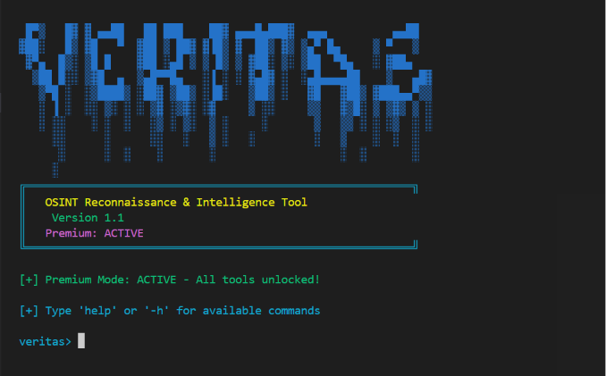
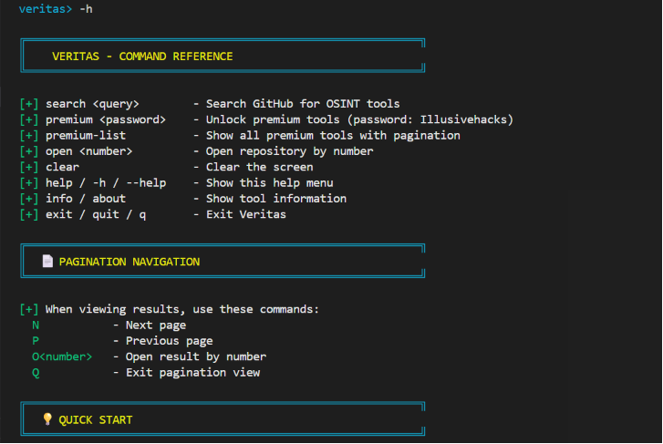
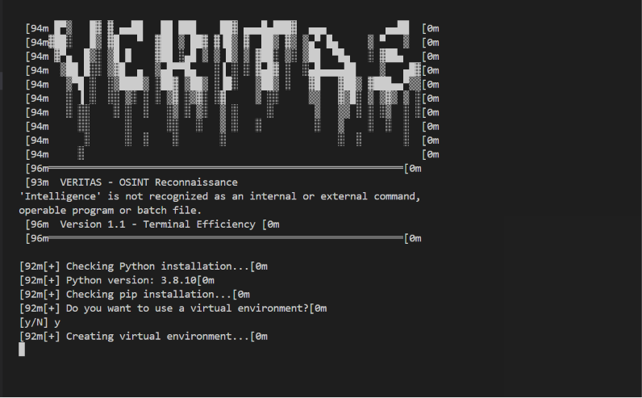

# VERITAS - OSINT Reconnaissance & Intelligence Tool

> *"Veritas" - Uncovering digital truth, one search at a time.*

---

##     Overview

**Veritas** is a powerful terminal-based OSINT (Open Source Intelligence) tool that eliminates the need for endless browser tabs and manual GitHub searches. Instead of opening your browser, typing queries, filtering through results and clicking through pages - **everything happens right in your terminal**.

**Why waste time?** With Veritas, you can:
- 🔍 **Search instantly** - No browser needed, results appear in seconds
- 📄 **Browse efficiently** - Navigate through hundreds of results with simple keyboard commands
- 🔗 **Open directly** - Launch tools in your browser with a single command
- 💎 **Discover premium tools** - Curated list of the best OSINT tools

---







##     Why Veritas? (Terminal Efficiency)

### The Problem:
- Opening browser → Navigating to GitHub → Typing search → Filtering results → Clicking through pages → Opening tabs for each tool
- **Time wasted:** Minutes per search
- **Focus lost:** Context switching between terminal and browser

### The Veritas Solution:
- Stay in your terminal - **No browser needed for searching**
- Results appear instantly with **full descriptions and links**
- Navigate pages with **simple keyboard commands** (N/P)
- Open any tool directly with **O<number>**
- **Time saved:** Seconds per search
- **Focus kept:** Everything in one place

---

##     Features

- **Terminal-First** - Search and browse without opening a browser
- **Blazing Fast** - Results appear in seconds, not minutes
- **Pagination System** - Browse through ALL results with page navigation (N/P)
- **Direct Links** - Every result shows its GitHub URL for quick access
- **Premium Tier** - 12+ exclusive OSINT tools curated for you
- **Beautiful Terminal UI** - Colored output with clear formatting
- **Unlock Premium** - With a single command
- **Built-in Help** - Simple explanations for all commands
- **Lightweight** - Runs anywhere Python runs (servers, VPS, Raspberry Pi)
- **⌨Keyboard Focused** - No mouse needed, pure terminal efficiency

---

##     Installation

### 1. Clone or Download

```bash
git clone https://github.com/illusiveai7/veritas.git
cd veritas

## 2. One-Click Setup (Recommended)
Choose your platform:

🐧 Linux / macOS

chmod +x setup.sh
./setup.sh

🪟 Windows

setup.bat


